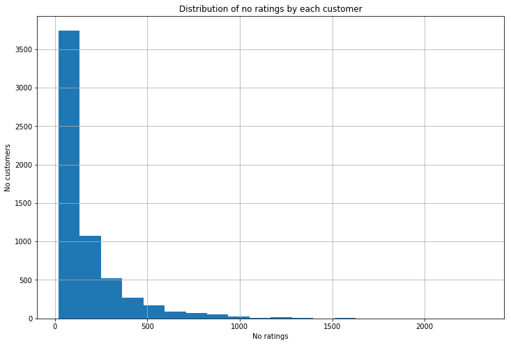
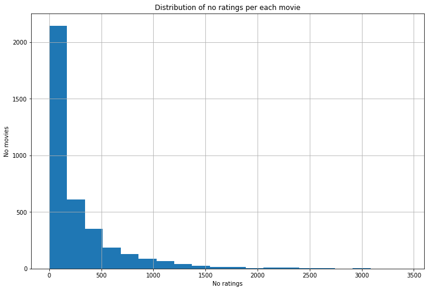

## 1. Giới thiệu về phương pháp Recommendation system
### 1. 1. Tầm quan trọng của recommendation system
Trong cuộc sống hàng ngày chúng ta thường thấy những tình huống khá tình cờ khi các hệ thống lớn có khả năng đọc và hiểu sở thích của người dùng và hiện thị những thông tin mà người dùng quan tâm rất chuẩn xác. Chẳng hạn như:

* Facebook có khả năng hiển thị trên newfeed những trạng thái của những người mà bạn quan tâm.
* Youtube có thể tự động nhảy sang những video mà bạn có khả năng yêu thích dựa trên những gì mà bạn đang xem.
* Amazon có thể đưa ra những cuốn sách cùng loại với những cuốn sách mà bạn đã mua hoặc rating cao.
* Google có thể đưa quảng cáo về một đồ vật phù hợp với những gì bạn tìm kiếm gần đây.

Nếu không có các thuật toán recommendation, trải nghiệm người dùng sẽ kém hơn vì thông tin mà họ thực sự quan tâm không được đưa ra đúng thời điểm trong khi thông tin không cần thiết được đưa ra nhiều hơn. Hậu quả là người dùng cảm thấy bị làm phiền và nhiễu loạn thông tin. Trong lĩnh vực marketing hệ thống recommendation lại càng trở nên quan trọng. Mỗi sản phẩm được đưa đến đúng người tiêu dùng có nhu cầu sẽ làm tăng doanh thu, giảm chi phí thời gian, chi phí quảng cáo và giúp người tiêu dùng sở hữu được thứ mình cần. Trong lĩnh vực giải trí như video, game, truyện online,... người dùng sẽ đạt độ hài lòng cao khi tìm được đúng loại hình giải trí yêu thích dễ dàng. Dù chỉ ra đời trong 10 năm trở lại đây, song hành cùng thời kì bùng nổ internet nhưng có thể nói `recommendation system` là một lĩnh vực nghiên cứu sôi động. Nó đã tạo ra một cuộc cách mạng thay đổi hành vi mua sắm, hành vi giải trí, chiến lược kinh doanh,... trên toàn cầu. Hàng trăm triệu các hộ kinh doanh nhỏ lẻ đang hưởng lợi từ nó thông qua khai thác nguồn khách hàng vô tận từ tài nguyên mạng và biến kênh bán hàng này thay thế các kênh truyền thống. Lĩnh vực này đồng thời là chìa khóa mấu chốt giúp các công ty công nghệ Google, Facebook, Amazon, Microsoft,... trở thành những tập đoành hàng đầu thể giới. Chính vì thế `recommendation system` luôn được các công ty kinh doanh trên nền tảng online đầu tư nghiên cứu và phát triển để tạo ra một hệ thống thông minh nhằm nâng cao trải nghiệm khách hàng và tối ưu hóa nguồn tài nguyên.

### 1.2. Phương pháp recommendation

Bên trên chúng ta đã biết vai trò của `recommendation system` đối với việc phát triển của lĩnh vực internet và kinh doanh online. Tuy nhiên thực sự bài toán `recommendation system` là gì? Cơ sở của phương pháp `recommendation system` ra sao chúng ta vẫn chưa thực sự hiểu rõ. Theo định nghĩa từ wikipedia thì `recommendation system` là một nhánh nhỏ của lĩnh vực *hệ thống chiết lọc thông tin* (information filtering system) được sử dụng để dự báo mức độ yêu thích thông qua rating của một người dùng (user) cho một sản phẩm (item). Để đưa ra được sản phẩm phù hợp nhất đến người dùng đòi hỏi các hệ thống phải dựa trên thông tin đã rating của sản phẩm, thông tin người dùng, thông tin về sản phẩm để xây dựng thuật toán tối ưu. Dựa trên hàm loss function để tính ra sai số dự báo của thuật toán và tìm ra một phương pháp có mức độ dự báo chuẩn xác nhất. Có rất nhiều các thuật toán khác nhau được sử dụng trong `recommendation system` nhưng về cơ bản chúng bao gồm 2 phương pháp chính: `Collaborative filtering` và `Content based filtering`. Điểm khác biệt cơ bản giữa 2 phương pháp này là:

* Collaborative filtering: Dựa trên mối quan hệ tương quan về mặt hành vi tiêu dùng hoặc đặc trưng sản phẩm để tìm ra các users hoặc items có chung đặc tính, sở thích. Từ đó dựa trên những thông tin mà nhóm người dùng hoặc sản phẩm liên quan gần nhất đã rating để đánh giá sản phẩm mà một người dùng cụ thể chưa rating. Tuy nhiên nhược điểm của thuật toán này là đưa ra dự báo về rating mà không hoàn toàn hiểu về user, item mà hoàn toàn dựa trên quan sát về mức độ tương đương giữa các nhóm users, items để dự báo. Thuật toán được sử dụng trong các bài toán này chủ yếu là k-nearest neighbor để tìm ra nhóm tương đương và ma trận hệ số tương quan được sử dụng để đo lường mức độ gần gũi về mặt hành vi hay đặc tính để phân nhóm.

* Content based filtering: Dựa trên những thông tin và nội dung liên quan đến sản phẩm như nhà sản xuất, thể loại, năm sản xuất, công dụng, đặc tính,... hoặc dựa trên thông tin của người dùng như giới tính, độ tuối, ngành nghề,... để đưa ra dự báo về rating của người đối với sản phẩm đó. Thuật toán này chỉ đơn thuần là các phương trình hồi qui giữa các chiều đặc tính của sản phẩm hoặc người dùng đối với điểm rating mà không tận dụng được tương quan về mặt hành vi giữa những nhóm người dùng hay đặc trưng sản phẩm như `Collaborative filtering`. Trong thực tế hành vi của người dùng lại cho thấy rất giống nhau nếu thuộc cùng một nhóm chẳng hạn như các nhóm nhạc thiền, nhạc vàng, nhạc trẻ, nhạc thiếu nhi sẽ phù hợp với người già, người trung niên, người trẻ, thiếu nhi. Không xem xét được các yếu tố tương quan theo nhóm là một hạn chế lớn của content based filtering.


Mỗi thuật toán đều có ưu, nhược điểm khác nhau và mức độ hiệu quả trong dự báo mức độ yêu thích các cặp (user, item) (*người dùng, sản phẩm*) cũng khác nhau tùy thuộc vào tập dữ liệu. Nhưng các thuật toán đều có điểm chung đó là sử dụng dữ liệu mà người dùng đã rating đối với các sản phẩm để làm cơ sở dự báo rating cho các sản phẩm chưa được đánh giá. Việc này cũng giống như chúng ta chơi trò chơi điền số vào *ma trận tiện ích* (utility matrix). Một chiều của ma trận ứng với users và chiều còn lại ứng với items. Các ô trên ma trận thể hiện giá trị rating của user tương ứng lên item. Như vậy sẽ có những ô đã được rating bởi người dùng và các ô còn lại chưa được rating. Quá trình giải bài toán cũng giống như việc chúng ta đi giải ma trận tại những ô còn thiếu sao cho sai số cuối cùng giữa dự báo và thực tế là nhỏ nhất. 

### 1.3. Giới thiệu thuật toán matrix factorization


Trong thuật toán matrix factorization chúng ta giả định đặc trưng của item được thể hiện qua ma trận $\mathbf{I}$ và hành vi của người dùng được thể hiện qua ma trận $\mathbf{U}$. Với mỗi dòng của ma trận $\mathbf{I}$ là một đặc trưng ẩn (*latent feature*) của sản phẩm và mỗi cột của $\mathbf{U}$ là mức độ yêu thích của một người dùng đối với đặc trưng ẩn tương ứng. Các đặc trưng ẩn này có thể coi như những nhân tố chính được tổng hợp từ nhiều thông tin liên quan đến sản phẩm tương tự như thành phần chính trong phép phân tích thành phần chính `PCA`. Đặc trưng của sản phẩm thứ m được thể hiện qua vector dòng $\mathbf{i_m}$ và hành vi của người dùng thứ n được thể hiện qua vector cột $\mathbf{u_n}$. Khi đó giá trị dự báo mức độ yêu thích của một người dùng n lên một sản phẩm m sẽ là tích của 2 vector $\mathbf{i_m}$ và $\mathbf{u_n}$:
$$y_mn = \mathbf{i_m} \mathbf{u_n}$$

ước lượng của ma trận tiện ích $\mathbf{\hat{Y}}$ sẽ được biểu diễn theo các ma trận hành vi $\mathbf{I}$ và ma trận người dùng $\mathbf{U}$ như sau:

$$\mathbf{\hat{Y}} \approx \left[ \begin{matrix}
\mathbf{i}_1\mathbf{u}_1 & \mathbf{i}_1\mathbf{u}_2 & \dots & \mathbf{i}_1 \mathbf{u}_N\\
\mathbf{i}_2\mathbf{u}_1 & \mathbf{i}_2\mathbf{u}_2 & \dots & \mathbf{i}_2 \mathbf{u}_N\\
\dots & \dots & \ddots & \dots \\
\mathbf{i}_M\mathbf{u}_1 & \mathbf{i}_M\mathbf{u}_2 & \dots & \mathbf{i}_M \mathbf{u}_N\\
\end{matrix} \right]
 = \left[ \begin{matrix}
\mathbf{i}_1 \\
\mathbf{i}_2 \\
\dots \\
\mathbf{i}_M \\
\end{matrix} \right]
\left[ \begin{matrix}
\mathbf{u}_1 & \mathbf{u}_2 & \dots & \mathbf{u}_N
\end{matrix} \right] = \mathbf{IU}$$


### 1.4. Thuật toán gradient descent

Giả sử rằng chúng ta đã có thông tin về các ma trận $\mathbf{U}$ và $\mathbf{I}$ điều chúng ta cần thực hiện bây giờ là coi các dòng của mỗi $\mathbf{I}$ là một item profile và mỗi cột của $\mathbf{U}$ là một user profile. Giả sử $\mathbf{I} \in \mathbb{R}^{M \times K}$, $\mathbf{U} \in \mathbb{R}^{K \times N}$, $\mathbf{Y} \in \mathbb{R}^{M \times N}$. Thông thường ta sẽ chọn số đặc trưng ẩn nhỏ hơn số lượng sản phẩm và người dùng. Khi đó Y sẽ được biểu diễn dưới dạng tích của 2 ma trận có rank nhỏ hơn (*Low-rank Matrix factorization*):

$$\hat{\mathbf{Y}} = \mathbf{I}\mathbf{U}$$

Hàm loss function của thuật toán chính là chuẩn [Frobenius norm](http://mathworld.wolfram.com/FrobeniusNorm.html) về độ lệch giữa $\mathbf{Y}$ và $\mathbf{\hat{Y}}$ như sau:

$$\mathcal{L(\mathbf{I},\mathbf{U})} = \frac{1}{2s}||\mathbf{Y}-\mathbf{\hat{Y}}||_{F}^2$$

Để tránh hiện tượng overfiting [hệ số hiệu chỉnh bậc 2](https://towardsdatascience.com/l1-and-l2-regularization-methods-ce25e7fc831c) (*l2 - reguralization*) được đưa thêm vào:

$$\mathcal{L(\mathbf{I},\mathbf{U})} = \frac{1}{2s}||\mathbf{Y}-\mathbf{\hat{Y}}||_{F}^2 + \frac{\lambda_1}{2}||\mathbf{I}||_{F}^2 + \frac{\lambda_2}{2}||\mathbf{U}||_{F}^2 \tag{1.4.1}$$ 

Nếu coi $\mathbf{U}$ cố định và cần tối ưu $\mathbf{I}$. Bài toán `Matrix factorization` sẽ tương đương với tối ưu hàm loss function:

$$\mathcal{L(\mathbf{I})} = \frac{1}{2s}||\mathbf{Y}-\mathbf{\hat{Y}}||_{F}^2 + \frac{\lambda_1}{2}||\mathbf{I}||_{F}^2$$
Nếu coi $\mathbf{I}$ cố định và cần tối ưu $\mathbf{U}$. Hàm loss function sẽ có dạng:

$$\mathcal{L(\mathbf{U})} = \frac{1}{2s}||\mathbf{Y}-\mathbf{\hat{Y}}||_{F}^2 + \frac{\lambda_2}{2}||\mathbf{U}||_{F}^2$$

Ta nhận thấy hàm loss function đều là những hàm lồi. Việc tìm nghiệm tối ưu có thể dựa trên bài toán tối ưu lồi bậc 2 (*Quadratic Programming*) hoặc cách đơn giản hơn là thông qua thuật toán `gradient descent`. Chúng ta sẽ sử dụng thuật toán `Stochastic gradient descent` để cập nhật lần lượt từng điểm dữ liệu trên toàn bộ dữ liệu, sau đó lặp lại quá trình này. Đối với trường hợp ma trận sản phẩm ($\mathbf{I}$) cố định, ta sẽ cần cập nhật ma trận người dùng ($\mathbf{U}$) theo phương gradient descent. Mỗi một lượt cập nhật, một người dùng u được lựa chọn. Dựa trên thông tin về những sản phẩm mà người dùng u đã rating. Vector gradient descent được tính toán để cập nhật giá trị của vector $\mathbf{u}$ tương ứng. Quá trình này tiếp tục cho đến khi toàn bộ các vector users được cập nhật. Tương tự như vậy đối với trường hợp cố định ma trận người dùng cố định và cập nhật ma trận sản phẩm. 

**Tối ưu ma trận người dùng:**

Để đơn giản hóa quá trình tính toán, ta có thể biểu diễn hàm loss function theo tổng loss function của từng user như sau:

$$\mathcal{L(\mathbf{U})} = \frac{1}{2s}\sum_{n = 1}^{N}\sum_{m: r_{mn} = 1} (y_{mn} - i_m . u_n)^2+\frac{\lambda_1}{2} ||\mathbf{U}||_{F}^2$$

Trong đó $r_{mn}$ là phần tử thuộc ma trận rating $R \in \mathbb{R}^{M \times N}$ có giá trị 0 hoặc 1. $r_{mn} = 1$ đánh dấu sản phẩm m đã được rating bởi user n và bằng 0 trong trường hợp chưa được rating. Điều kiện $r_{mn} = 1$ trong hàm loss function là để lọc ra những sản phẩm đã được rating bởi user n. Khi đó nếu coi $\hat{\mathbf{I}}_n$ là ma trận các sản phẩm đã được rating của user n và $\hat{y}_n$ là vector kết quả rating tương ứng thì hàm loss function đối với user n được viết gọn như sau:

$$\mathcal{L(\mathbf{U}| user = n)} = \frac{1}{2s}\sum_{m: r_{mn} = 1}(y_{mn} - \mathbf{i_m} . \mathbf{u_n})^2 + \frac{\lambda_1}{2}||\mathbf{u_n}||^2 = \frac{1}{2s}||\hat{y}_n-\hat{\mathbf{I}}_n. \mathbf{u_n}||^2 + \frac{\lambda_1}{2}||\mathbf{u_n}||^2$$

Đạo hàm của nó tương ứng:

$$\frac{\partial \mathcal{L(\mathbf{U}| user = n)}}{\partial \mathbf{u_n}} = -\frac{1}{s}\hat{\mathbf{I}}_n^{T}\space (\hat{y}_n-\hat{\mathbf{I}}_n. \mathbf{u_n}) + \lambda_1\mathbf{u_n}$$

Công thức cập nhật nghiệm cho mỗi cột của ma trận người dùng:

$$\mathbf{u'_n} = \mathbf{u_n} - \theta (-\frac{1}{s}\hat{\mathbf{I}}_m^{T}\space (\hat{y}_n-\hat{\mathbf{I}}_n. \mathbf{u_n}) + \lambda_1\mathbf{u_n})$$

**Tối ưu ma trận sản phẩm:**

Hoàn toàn tương tự ta cũng có đối với ma trận sản phẩm, hàm loss function đối với item = m:

$$\mathcal{L(\mathbf{I}| item = m)} = \frac{1}{2s}\sum_{n: r_{mn} = 1}(y_{mn} - \mathbf{i_m} . \mathbf{u_n})^2 + \frac{\lambda_1}{2}||\mathbf{i_m}||^2 = \frac{1}{2s}||\hat{y}_m-\mathbf{i_m}.\hat{\mathbf{U}}_m||^2 + \frac{\lambda_1}{2}||\mathbf{i_m}||^2$$

Đạo hàm tương ứng đối với mỗi item sẽ là:

$$\frac{\partial \mathcal{L(\mathbf{I}| item = m)}}{\partial \mathbf{i_m}} = -\frac{1}{s}(\hat{y}_n-\mathbf{i_m}. \hat{\mathbf{U}}_m)\hat{\mathbf{U}}_m^{T} + \lambda_1\mathbf{i_m}$$

Công thức cập nhật nghiệm cho mỗi dòng của ma trận sản phẩm:

$$\mathbf{i'_m} = \mathbf{i_m} - \theta (-\frac{1}{s}(\hat{y}_n-\mathbf{i_m}. \hat{\mathbf{U}}_m)\hat{\mathbf{U}}_m^{T} + \lambda_1\mathbf{i_m})$$

## 2. Xây dựng code thuật toán

### 2.1. Thực hành trên bộ dữ liệu movie length 1M

Chúng ta sẽ thực hiện phương pháp `matrix factorization` trên bộ dữ liệu [Movie length 1M](http://files.grouplens.org/datasets/movielens/ml-1m.zip) gồm 1 triệu các lượt ratings cho khoảng 4000 bộ phim được thu thập từ 6000 người dùng. Để tiện phù hợp với thuật toán đã xây dựng, các xử lý dữ liệu sẽ được thực hiện trên ma trận. Load dữ liệu đầu vào như sau:


```python
import pandas as pd
import numpy as np
columns = ['user_id', 'item_id', 'rating', 'timestamp']
movie_length = pd.read_csv('ml-1m/ratings.dat', header = 0, \
                           names = columns, sep = '::', engine = 'python')
movie_length = movie_length.sort_values(['user_id', 'item_id'])
movie_length.head()
```


<div>
<style scoped>
    .dataframe tbody tr th:only-of-type {
        vertical-align: middle;
    }

    .dataframe tbody tr th {
        vertical-align: top;
    }

    .dataframe thead th {
        text-align: right;
    }
</style>
<table border="1" class="dataframe">
  <thead>
    <tr style="text-align: right;">
      <th></th>
      <th>user_id</th>
      <th>item_id</th>
      <th>rating</th>
      <th>timestamp</th>
    </tr>
  </thead>
  <tbody>
    <tr>
      <th>39</th>
      <td>1</td>
      <td>1</td>
      <td>5</td>
      <td>978824268</td>
    </tr>
    <tr>
      <th>24</th>
      <td>1</td>
      <td>48</td>
      <td>5</td>
      <td>978824351</td>
    </tr>
    <tr>
      <th>38</th>
      <td>1</td>
      <td>150</td>
      <td>5</td>
      <td>978301777</td>
    </tr>
    <tr>
      <th>43</th>
      <td>1</td>
      <td>260</td>
      <td>4</td>
      <td>978300760</td>
    </tr>
    <tr>
      <th>22</th>
      <td>1</td>
      <td>527</td>
      <td>5</td>
      <td>978824195</td>
    </tr>
  </tbody>
</table>
</div>


Kích thước các dữ liệu và số lượng users, items


```python
print('Data movie length shape: %s'%str(movie_length.shape))
print('No customers: %s'%str(np.unique(movie_length.iloc[:, 0]).shape[0]))
print('No movies: %s'%str(np.unique(movie_length.iloc[:, 1]).shape[0]))
```

    Data movie length shape: (1000208, 4)
    No customers: 6040
    No movies: 3706
    

Thống kê mô tả số tần suất rating của các users:


```python
movie_length['user_id'].value_counts().describe()
```


    count    6040.000000
    mean      165.597351
    std       192.747126
    min        20.000000
    25%        44.000000
    50%        96.000000
    75%       208.000000
    max      2314.000000
    Name: user_id, dtype: float64


* Bình quân một user rate tổng cộng 165 bộ phim. 
* User thấp nhất rate 20 bộ phim và user nhiều nhất rate 2314 bộ phim. 
* Khoảng số lượng bộ phim rating phổ biến của một user là từ 44 bộ tới 208 bộ phim (chiếm 50%).


```python
import matplotlib.pyplot as plt
%matplotlib inline
movie_length[['user_id', 'item_id']].groupby(['user_id']).count().\
hist(bins = 20, figsize = (12, 8))
plt.title('Distribution of no ratings by each customer')
plt.xlabel('No ratings')
plt.ylabel('No customers')
```


    Text(0,0.5,'No customers')





Nhìn vào phân bố của số lượng user theo mức độ rating ta có thể thấy mẫu của chúng ta có hiện tượng không cân bằng khi có nhiều user rating rất ít và nhiều user rating nhiều hơn. Tuy nhiên đây không phải là bài toán classification nên việc mẫu có kích thước mất cân bằng cũng không ảnh hưởng tới mức độ chính xác của thuật toán. Hơn nữa thuật toán `matrix factorization` xây dựng hàm loss function riêng lẻ cho từng user nêu việc user này rating bao nhiêu sản phẩm không ảnh hưởng đến kết quả dự báo rating của user khác. Hoàn toàn tương tự ta cũng thống kê được số lượng các user rating đối với từng bộ phim.


```python
movie_length['item_id'].value_counts().describe()
```


    count    3706.000000
    mean      269.888829
    std       384.046815
    min         1.000000
    25%        33.000000
    50%       123.500000
    75%       350.000000
    max      3428.000000
    Name: item_id, dtype: float64


```python
movie_length[['user_id', 'item_id']].groupby(['item_id']).count().\
hist(bins = 20, figsize = (12, 8))
plt.title('Distribution of no ratings per each movie')
plt.xlabel('No ratings')
plt.ylabel('No movies')
```


    Text(0,0.5,'No movies')





Một vài đánh giá:
* Số lần 1 bộ phim được rating ít nhất là 1 lần.
* Số lần 1 bộ phim được rating nhiều nhất là 3428 lần.
* Mức độ rating phổ biến của một bộ phim là từ 33 đến 123 lần.

## 2.2. Thuật toán matrix factorization

### 2.2.1. Các hàm trong thuật toán

Đầu tiên ta sẽ tiến hành chia mẫu train và test theo tỷ lệ sao cho số lượng rating trong tập train chiếm 2/3 số lượng các lượt rating. Cách chia mẫu hợp lý nhất là đảm bảo tỷ lệ số lượng ratings xuất hiện trong tập train đối với số lượng ratings xuất hiện trong tập test của cùng một user là bằng nhau. Cách chia này đảm bảo sự công bằng đối với các user khi không có user nào có quá nhiều dữ liệu train và dữ liệu test ít hoặc dữ liệu train quá ít nhưng dữ liệu test lại quá nhiều. Giá trị được dự báo từ mô hình mà dữ liệu train quá ít sẽ thường không chuẩn xác và làm sai lệch kết quả kiểm tra sai số trên test. 


```python
#declare split_rate for train/total ratings
split_rate = 2/3

def split_train_test(dataset):
    gb = dataset.groupby('user_id')
    ls = [gb.get_group(x) for x in gb.groups]
    items = [x for x in gb.groups]
    index_size = [{'i': i, 'index':gb.groups[i], 'size':len(gb.groups[i])} for i in items]
    index_train = pd.Int64Index([])
    index_test = pd.Int64Index([])
    for x in index_size:
        np.random.shuffle(x['index'].values)
        le = int(x['size']*split_rate)
        index_train = index_train.append(x['index'][:le])
        index_test = index_test.append(x['index'][le:])
    train = dataset.iloc[index_train].values
    test = dataset.iloc[index_test].values
    #minus id to 1 to index start from 0
    train[:, 0] -= 1
    train[:, 1] -= 1
    test[:, 0] -= 1
    test[:, 1] -= 1
    return train, test

train, test = split_train_test(movie_length)
```

**Tiến hành xây dựng thuật toán:**

Các biến chính cho thuật toán dữ báo bao gồm:
* n_users: Số lượng user (chính là $N$ trong thuật toán).
* n_items: Số lượng item (chính là $M$ trong thuật toán).
* K: Số lượng nhân tố ẩn được sử dụng (giá trị $K$ trong thuật toán). 
* theta: Tham số $\theta$ để cập nhật hệ số trong thuật toán gradient descent.
* split_rate: Tỷ lệ chia mẫu train/test.
* lamda: Tham số hiệu chỉnh của thành phần hiệu chỉnh `l2 - regularization` (Để đơn giản thiết lập $\lambda_1 = \lambda_2$).
* I: Ma trận sản phẩm.
* U: Ma trận người dùng.

Lưu ý rằng các ma trận $\mathbf{I}, \mathbf{U}$ được xây dựng dựa trên các *nhân tố ẩn* (latent feature) nên ban đầu ta chưa xác định được các nhân tố này và phải khởi tạo giá trị ngẫu nhiên cho chúng. Số lượng nhân tố ẩn $K$ là một giá trị tùy ý ta có thể lựa chọn. Theo [Matrix Factorization For Recommendation System](https://datajobs.com/data-science-repo/Recommender-Systems-%5BNetflix%5D.pdf) thì khi số lượng nhân tố ẩn càng nhiều thuật toán càng chính xác hơn nhưng cũng làm gia tăng chi phí tính toán.  Đồng thời những mô hình được xây dựng dựa trên nhân tố ẩn đã được tinh luyện để có mức độ khác biệt lớn cũng đưa ra kết quả chính xác hơn các việc tạo ra các nhân tố ẩn ngẫu nhiên. 


```python
n_users = np.max(train[:, 0] + 1) #plus one because index start from 0
n_items = np.max(train[:, 1] + 1)
n_ratings = train.shape[0]
print('N user dimesion: %s'%n_users)
print('M item dimesion: %s'%n_items)
print('S Number of rating: %s'%n_ratings)
K = 2
theta = 0.75
lamda = 0.2
#Inititalize random matrix according to Gauss distribution
I = np.random.randn(n_items, K)
U = np.random.randn(K, n_users)
```

    N user dimesion: 6040
    M item dimesion: 3952
    S Number of rating: 664826
    


```python
import scipy.sparse as sparse
#Rating matrix
Y = np.zeros(shape = (n_items, n_users))
print('Y utility matrix shape: %s'%str(Y.shape))
Y = sparse.coo_matrix((train[:, 2], (train[:, 1], train[:, 0])),\
                      shape = (n_items, n_users), dtype = np.float).toarray()
```

    Y utility matrix shape: (3952, 6040)
    

Không phải hoàn toàn các giá trị trên ma trận $\mathbf{Y}$ đều được rating. Vì vậy ma trận $\mathbf{R}$ được tạo ra nhằm đánh dấu các vị trí được rating của $\mathbf{Y}$ bằng giá trị 1 và chưa được rating bằng 0.


```python
R = sparse.coo_matrix((np.ones((n_ratings,)), (train[:, 1], train[:, 0])),\
                      shape = (n_items, n_users)).toarray()
```

Để thuật toán `gradient descent` hội tụ nhanh hơn chúng ta cần chuẩn hóa ma trận $\mathbf{Y}$ về giá trị kì vọng bằng 0 bằng cách trừ đi mỗi giá trị rating trong vector rating của một user với trung bình của vector rating đó.


```python
def standardize_Y(Y):
    sum_rating = Y.sum(axis = 0)
    u_rating = np.count_nonzero(Y, axis = 0)
    u_mean = sum_rating/u_rating
    for n in range(n_users):
        for m in range(n_items):
            if Y[m, n] != 0:
                Y[m, n] -= u_mean[n]
    return Y, u_mean

Y_stad, u_mean = standardize_Y(Y)
```

Sau khi chuẩn hóa ma trận $\mathbf{Y}$ thì phần quan trọng nhất là áp dụng thuật toán `gradient descent` để tối ưu hóa các hệ số của ma trận $\mathbf{U}, \mathbf{I}$. Dựa trên lý thuyết về thuật toán đã xây dựng ở mục **1.4** để xây dựng các hàm số update ma trận:

**Thuật toán gradient descent cho ma trận người dùng:**


```python
def updateU(U):
    for n in range(n_users):
    # Matrix items include all items is rated by user n
        i_rated = np.where(Y_stad[:, n] != 0)[0] #item's index rated by n
        In = I[i_rated, :]
        if In.shape[0] == 0:
            U[:, n] = 0
        else: 
            s = In.shape[0]
            u_n = U[:, n]
            y_n = Y_stad[i_rated, n]
            grad = -1/s * np.dot(In.T,(y_n-np.dot(In, u_n))) + lamda*u_n
            U[:, n] -= theta*grad
    return U
```

**Thuật toán gradient descent cho ma trận sản phẩm:**


```python
def updateI(I):
    for m in range(n_items):
    # Matrix users who rated into item m
        i_rated = np.where(Y_stad[m, :] != 0)[0] #user's index rated into m
        Um = U[:, i_rated]
        if Um.shape[1] == 0: 
            I[m, :] = 0
        else:
            s = Um.shape[1]
            i_m = I[m, :]
            y_m = Y_stad[m, i_rated]
            grad = -1/s * np.dot(y_m - np.dot(i_m, Um), Um.T) + lamda*i_m
            I[m, :] -= theta*grad
    return I
```

**Xây dựng hàm dự báo ma trận $\mathbf{Y}$:**

Dựa trên ma trận $\mathbf{U}$ và $\mathbf{I}$ ta có thể tính toán ma trận dự báo của $\mathbf{Y}$ là $\mathbf{\hat{Y}}$ theo công thức *(1.4.0)* và xây dựng được hàm *pred()*. Các kết quả dự báo cần được chuyển hóa ngược lại rating bằng cách cộng thêm trung bình rating của mỗi user vào các giá trị ratings thuộc cùng 1 user. Một số kết quả sẽ vượt quá miền giá trị của rating là [1, 5] và khi đó sẽ được gán lại về 2 đầu mút 1 hoặc 5. Ma trận thu được sẽ thỏa mãn tại một ô của $\mathbf{\hat{Y}}$ là kết quả dự báo rating của người dùng đối với sản phẩm tương ứng. Do ta chỉ cần đánh giá trận $\mathbf{Y}$ trên những cặp (user,item) đã được rating nên trong hàm *pred_train_test()* ta cần dựa vào ma trận rating $\mathbf{R}$ để thay thế những vị trí chưa được rating bằng 0. Lý do hàm số này được đặt tên là *pred_train_test()* đó là chúng ta cũng có thể thực hiện tương tự cho tập test khi thay thế giá trị chưa rating bằng 0.


```python
def pred(U, I):
    #predict utility matrix base on formula Y_hat = I.U
    Y_hat = np.dot(I, U)
    #invert to forecast values by plus user's mean ratings
    for n in range(n_users):
        Y_hat[:, n] += u_mean[n]
    #convert to interger values because of rating is integer
    Y_hat = Y_hat.astype(np.int32) 
    #replace values > 5 by 5 and values < 1 by 1
    Y_hat[Y_hat > 5] = 5
    Y_hat[Y_hat < 1] = 1
    return Y_hat

def pred_train_test(Y_hat, R):
    #replace values have not yet rated by 0 
    Y_pred = Y_hat.copy()
    Y_pred[R == 0] = 0
    return Y_pred
```

**Xây dựng hàm loss function:**

Hàm loss function được xây dựng dựa trên công thức *(1.4.1)* như sau:


```python
def loss(Y, Y_hat):
    error = Y-Y_hat
    loss_value = 1/(2*n_ratings)*np.linalg.norm(error, 'fro')**2 + \
    lamda/2*(np.linalg.norm(I, 'fro')**2 + np.linalg.norm(U, 'fro')**2)
    return loss_value
```

Sử dụng ma trận $\mathbf{\hat{Y}}$ để dự báo trên tập test


```python
Y_test = sparse.coo_matrix((test[:, 2], (test[:, 1], test[:, 0])), \
                           shape = (n_items, n_users), dtype = np.float).toarray()
R_test = sparse.coo_matrix((np.ones(test.shape[0]), (test[:, 1], test[:, 0])), \
                           shape = (n_items, n_users), dtype = np.float).toarray()
```

**Xây dựng hàm tính RMSE:**

Sau khi tính được ma trận dự báo $\mathbf{\hat{Y}}$ trên tập test kết hợp với ma trận tiện ích $\mathbf{Y}$ của tập test đã biết ta sẽ tính được *RMSE* trên tập test như sau:


```python
import math
def RMSE(Y_test, Y_pred):
    error = Y_test - Y_pred
    n_ratings = test.shape[0]
    rmse = math.sqrt(np.linalg.norm(error, 'fro')**2/n_ratings)
    return rmse
```

**Xây dựng vòng lặp tối ưu chính:**
    
Sau khi đã thiết kế được các hàm tính toán *loss function, RMSE* và các hàm tối ưu *gradient descent* ta sẽ tiến hành xây dựng vòng lặp tối ưu để cập nhật các ma trận $\mathbf{U}$ và $\mathbf{I}$ và đánh giá hiệu quả của mỗi bước lặp thông qua giá trị của *loss function* và *RMSE*.


```python
def fit(Umatrix, Imatrix, Ytrain, Ytest, n_iter, log_iter):
    for i in range(n_iter):
        #update U and I
        Umatrix = updateU(Umatrix)
        Imatrix = updateI(Imatrix)
        #calculate Y_hat
        Y_hat = pred(Umatrix, Imatrix)
        #calculate Y_hat_train by replace non ratings by 0
        Y_pred_train = pred_train_test(Y_hat, R)
        #calculate loss function
        loss_value = loss(Ytrain, Y_pred_train)
        #calculate Y_pred on test dataset
        Y_pred_test = pred_train_test(Y_hat, R_test)
        #calculate RMSE
        rmse = RMSE(Ytest, Y_pred_test)
        if i % log_iter == 0:
            print('Iteration: {}; RMSE: {}; Loss value: {}'.format(i, rmse, loss_value))
    return Y_hat, Y_pred_test   
Y_hat, Y_pred = fit(Umatrix = U, Imatrix = I, Ytrain = Y, Ytest = Y_test, n_iter = 100, log_iter = 10)
```

    Iteration: 0; RMSE: 1.0978996819873132; Loss value: 367.43589641528513
    Iteration: 10; RMSE: 1.0972517727989382; Loss value: 371.61999405456453
    Iteration: 20; RMSE: 1.0967013607569651; Loss value: 376.1721780533387
    Iteration: 30; RMSE: 1.096062264477316; Loss value: 380.4612541939793
    Iteration: 40; RMSE: 1.0953942145953313; Loss value: 384.2559773463809
    Iteration: 50; RMSE: 1.0948442303904773; Loss value: 387.81426251576477
    Iteration: 60; RMSE: 1.0945337212732151; Loss value: 390.15217556003586
    Iteration: 70; RMSE: 1.0943198545615616; Loss value: 391.6867939243047
    Iteration: 80; RMSE: 1.0941863369527691; Loss value: 392.6789203399845
    Iteration: 90; RMSE: 1.0940269119371213; Loss value: 393.30221888979895
    

### 2.2.2. Xây dựng class MF

Dựa trên các hàm đã xử lý ở *(2.2.1)* ta sẽ thiết kế class MF có chức năng xử lý dữ liệu, fiting model, đánh giá kết quả model và đưa ra các recommend cho khách hàng về sản phẩm như sau:

**Class Data xử lý dữ liệu:**


```python
class Data(object):
    """
    This class used to manage data.
    Two arguments:
    dataset: pandas data frame include user_id, item_id and rating
    split_rate: number train ratings/ total ratings
    """
    def __init__(self, dataset, split_rate):
        self.dataset = dataset
        self.split_rate = split_rate
        self.train, self.test = self.split_train_test(self.dataset)
        self.Ytrain, self.Rtrain = self.utility_matrix(self.train)
        self.Ytest , self.Rtest  = self.utility_matrix(self.test)
        self.Ystad,  self.u_mean = self.standardize_Y(self.Ytrain)
        self.n_users = np.max(self.train[:, 0] + 1) #plus one because index start from 0
        self.n_items = np.max(self.train[:, 1] + 1)
        self.n_ratings = self.train.shape[0]
        
    def split_train_test(self, dataset):
        "split train and test"
        gb = dataset.groupby('user_id')
        ls = [gb.get_group(x) for x in gb.groups]
        items = [x for x in gb.groups]
        index_size = [{'i': i, 'index':gb.groups[i], 'size':len(gb.groups[i])} for i in items]
        index_train = pd.Int64Index([])
        index_test = pd.Int64Index([])
        for x in index_size:
            np.random.shuffle(x['index'].values)
            le = int(x['size']*split_rate)
            index_train = index_train.append(x['index'][:le])
            index_test = index_test.append(x['index'][le:])
        train = dataset.iloc[index_train].values
        test = dataset.iloc[index_test].values
        #minus id to 1 to index start from 0
        train[:, 0] -= 1
        train[:, 1] -= 1
        test[:, 0] -= 1
        test[:, 1] -= 1
        return train, test
    
    def utility_matrix(self, data_mtx):
        "create Y and R matrix"
        Y = np.zeros(shape = (n_items, n_users))
        Y = sparse.coo_matrix((data_mtx[:, 2], (data_mtx[:, 1], data_mtx[:, 0])), \
                              shape = (n_items, n_users), dtype = np.float).toarray()
        R = sparse.coo_matrix((np.ones((data_mtx.shape[0],)), (data_mtx[:, 1], data_mtx[:, 0])), \
                              shape = (n_items, n_users)).toarray()
        return Y, R
    
    def standardize_Y(self, Y):
        "standard data to mean ratings of each user = 0"
        sum_rating = Y.sum(axis = 0)
        u_rating = np.count_nonzero(Y, axis = 0)
        u_mean = sum_rating/u_rating
        for n in range(n_users):
            for m in range(n_items):
                if Y[m, n] != 0:
                    Y[m, n] -= u_mean[n]
        return Y, u_mean
```

**Class model xây dựng và đánh giá model:**


```python
class Model():
    """
    This class manage update U and I matrix, predict and evaluate error
    Four arguments:
    data: instance from Data class which supplies the data for model
    theta: learning rate
    lamda: regularization parameter
    K: number of latent factors
    """
    def __init__(self, data, theta, lamda, K):
        self.data = data
        self.theta = theta
        self.lamda = lamda
        self.K = K
        self.I = np.random.randn(data.n_items, K)
        self.U = np.random.randn(K, data.n_users)
        
               
    def updateU(self):
        for n in range(self.data.n_users):
        # Matrix items include all items is rated by user n
            i_rated = np.where(self.data.Ystad[:, n] != 0)[0] #item's index rated by n
            In = self.I[i_rated, :]
            if In.shape[0] == 0:
                self.U[:, n] = 0
            else: 
                s = In.shape[0]
                u_n = self.U[:, n]
                y_n = self.data.Ystad[i_rated, n]
                grad = -1/s * np.dot(In.T,(y_n-np.dot(In, u_n))) + self.lamda*u_n
                self.U[:, n] -= self.theta*grad
         
    def updateI(self):
        for m in range(self.data.n_items):
        # Matrix users who rated into item m
            i_rated = np.where(self.data.Ystad[m, :] != 0)[0] #user's index rated into m
            Um = self.U[:, i_rated]
            if Um.shape[1] == 0: 
                self.I[m, :] = 0
            else:
                s = Um.shape[1]
                i_m = self.I[m, :]
                y_m = self.data.Ystad[m, i_rated]
                grad = -1/s * np.dot(y_m - np.dot(i_m, Um), Um.T) + self.lamda*i_m
                self.I[m, :] -= self.theta*grad
    
    def pred(self, I, U):
        #predict utility matrix base on formula Yhat = I.U
        Yhat = np.dot(I, U)
        #invert to forecast values by plus user's mean ratings
        for n in range(self.data.n_users):
            Yhat[:, n] += self.data.u_mean[n]
        #convert to interger values because of rating is integer
        Yhat = Yhat.astype(np.int32) 
        #replace values > 5 by 5 and values < 1 by 1
        Yhat[Yhat > 5] = 5
        Yhat[Yhat < 1] = 1
        return Yhat

    def pred_train_test(self, Yhat, R):
        #replace values have not yet rated by 0 
        Y_pred = Yhat.copy()
        Y_pred[R == 0] = 0
        return Y_pred
    
    def loss(self, Y, Yhat):
        error = Y-Yhat
        n_ratings = np.sum(Y != 0)
        loss_value = 1/(2*n_ratings)*np.linalg.norm(error, 'fro')**2 +\
        lamda/2*(np.linalg.norm(self.I, 'fro')**2 + \
                 np.linalg.norm(self.U, 'fro')**2)
        return loss_value
    
    def RMSE(self, Y, Yhat):
        error = Y - Yhat
        n_ratings = np.sum(Y != 0)
        rmse = math.sqrt(np.linalg.norm(error, 'fro')**2/n_ratings)
        return rmse
```

**Xây dựng class MF quản lý model và data:**


```python
class MF():
    """
    This class used to manage model and data
    Two main arguments:
    data: control the data
    model: control the functions which execute model
    """
    def __init__(self, data, model, n_iter, print_log_iter):
        self.data = data
        self.model = model
        self.n_iter = n_iter
        self.print_log_iter = print_log_iter
        self.Y_pred_train = None
        self.Y_pred_test = None
        self.Yhat = None
        
    def fit(self):
        for i in range(self.n_iter):
            #update U and I
            self.model.updateU()
            self.model.updateI()
            #calculate Y_hat
            self.Yhat = self.model.pred(self.model.I, self.model.U)
            #calculate Y_pred_train by replace non ratings by 0
            self.Y_pred_train = self.model.pred_train_test(self.Yhat, self.data.Rtrain)
            self.Y_pred_test  = self.model.pred_train_test(self.Yhat, self.data.Rtest)
            if i % self.print_log_iter == 0:
                print('Iteration: {}; RMSE: {}; Loss value: {}'.\
                      format(i, self.model.RMSE(self.data.Ytest, self.Y_pred_test),\
                             self.model.loss(self.data.Ytrain, self.Y_pred_train)))
                
    def recommend_for_user(self, user_id, k_neighbors):
        recm = np.concatenate((np.arange(1, self.Y_pred_test.shape[0]+1).reshape(-1, 1), \
                               self.Y_pred_test[:, user_id - 1].reshape(-1, 1)), axis = 1)
        recm.sort(axis = 0)
        print('Top %s item_id recommended to user_id %s: %s'%\
              (k_neighbors, user_id, str(recm[-k_neighbors:, 0])))
```


```python
data = Data(dataset = movie_length, split_rate = 2/3)
model = Model(data = data, theta = 0.75, lamda = 0.1, K = 2)
mf = MF(data = data, model = model, n_iter = 100, print_log_iter = 10)
mf.fit()
```

    Iteration: 0; RMSE: 1.2230236685162748; Loss value: 681.8471565701848
    Iteration: 10; RMSE: 1.1780718373263668; Loss value: 286.40240426148296
    Iteration: 20; RMSE: 1.087117979096145; Loss value: 518.2976746384784
    Iteration: 30; RMSE: 1.08441027204107; Loss value: 534.4106319526331
    Iteration: 40; RMSE: 1.08385608972465; Loss value: 546.1164972768984
    Iteration: 50; RMSE: 1.0828157171073196; Loss value: 559.6753058301773
    Iteration: 60; RMSE: 1.079754860855491; Loss value: 575.3332305811103
    Iteration: 70; RMSE: 1.0750987045005322; Loss value: 590.821120508004
    Iteration: 80; RMSE: 1.0709110406988624; Loss value: 602.5417655852891
    Iteration: 90; RMSE: 1.0685236770672915; Loss value: 608.9641965725858
    

Ta nhận thấy kết quả của hàm `loss function` và `RMSE` giảm dần sau các vòng lặp. Điều đó cho thấy thuật toán `gradient descent` đã phát huy tác dụng trong việc làm giảm sai số dự báo. Tuy nhiên đôi khi chúng ta sẽ gặp tình huống `loss function` và `RMSE` tăng dần. Có nhiều nguyên nhân dẫn tới điều này chẳng hạn như hệ số `learning rate` và `regularization` được thiết lập quá cao làm thuật toán nhảy ra khỏi cực trị toàn cục hoặc cũng có thể các `loss function` chỉ tăng tạm thời và giảm sau đó để nghiệm di chuyển qua điểm cực trị địa phương. Đối với khả năng 1 chúng ta cần điều chỉnh lại các hệ số `learning rate` và `regularization` để thuật toán di chuyển đúng hướng tới nghiệm tối ưu. Khả năng thứ 2 không quá nghiêm trọng bởi thuật toán có thể di chuyển tới nghiệm tối ưu ngay sau đó.

Recommend 10 sản phẩm tiềm năng nhất cho user_id = 200:


```python
mf.recommend_for_user(user_id = 200, k_neighbors = 10)
```

    Top 10 item_id recommended to user_id 200: [3943 3944 3945 3946 3947 3948 3949 3950 3951 3952]
    

## 2.3. Tài liệu tham khảo

1. [Recommendation System - Stanford](http://infolab.stanford.edu/~ullman/mmds/ch9.pdf)
2. [Collaborative Filtering Youtube - Stanford](https://www.youtube.com/watch?v=h9gpufJFF-0&t=436s)
3. [Recommendation System - Machine Learning - Andrew Ng](https://www.youtube.com/watch?v=YW2b8La2ICo)
4. [Matrix Factorization - Machine Learning Cơ Bản - Tiep Huu Vu](https://machinelearningcoban.com/2017/05/31/matrixfactorization/)
5. [Matrix Factorization techniques for recommender systems](https://datajobs.com/data-science-repo/Recommender-Systems-%5BNetflix%5D.pdf)
6. [Learning from Incomplete Ratings Using Non-negative Matrix Factorization](https://archive.siam.org/meetings/sdm06/proceedings/059zhangs2.pdf)
7. [Matrix Factorization - Albert Au Yeung](http://www.albertauyeung.com/post/python-matrix-factorization/)
8. [Algorithms for Non-negative Matrix Factorization - Daniel D.Lee and H. Sebastian Seung](http://hebb.mit.edu/people/seung/papers/nmfconverge.pdf)
